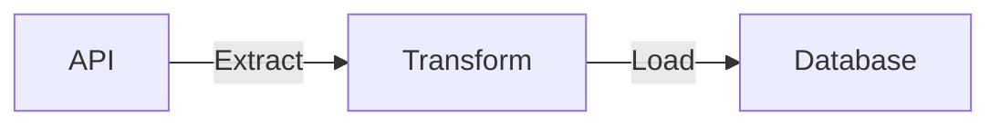

## Project design



We pull data from Reddit/Twitter API, transform them using python and load them into a database.

## Prerequisites

1. [Python3](https://www.python.org/downloads/)
2. [sqlite3](https://www.sqlite.org/download.html) (comes preinstalled on most os)
3. [Reddit app](https://www.geeksforgeeks.org/how-to-get-client_id-and-client_secret-for-python-reddit-api-registration/). You'll need your reddit apps **`REDDIT_CLIENT_ID, REDDIT_CLIENT_SECRET, & REDDIT_USER_AGENT`**.
4. [Twitter API token](https://developer.twitter.com/en/docs/twitter-api/getting-started/getting-access-to-the-twitter-api), you'll need your twitter APIs **`BEARER_TOKEN`**.
5. [git](https://git-scm.com/book/en/v2/Getting-Started-Installing-Git)

```bash
git clone https://github.com/josephmachado/socialetl.git
cd socialetl
```

## Setup

Create a `.env` in the project's root directory, with the following content
```txt
REDDIT_CLIENT_ID=replace-with-your-reddit-client-id
REDDIT_CLIENT_SECRET=replace-with-your-reddit-client-secret
REDDIT_USER_AGENT=replace-with-your-reddit-user-agent
BEARER_TOKEN=replace-with-your-twitter-bearer-token
```

Run the following commands are to be run via the terminal, from your project root directory.

```bash
python3 -m venv venv # Create a venv
. venv/bin/activate # activate venv
pip install -r requirements.txt # install requirements
make ci # Run tests, check linting, & format code
make reset-db # Creates DB schemas
make reddit-etl # ETL reddit data
make twitter-elt # ETL twitter data
make db # open the db to check ELT-ed data 
```

```sqlite
select source, count(*) from social_posts group by 1;
.exit
```

Set up git hooks. Create a pre-commit file, as shown below.

```bash
echo -e '
#!/bin/sh
make ci
' > .git/hooks/pre-commit
chmod ug+x .git/hooks/*
```

## Make commands

We have some make commands to make things run better, please refer to the [Makefile](./Makefile) to see them.
