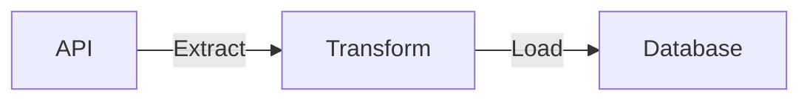

## Project design



We pull data from Reddit/Twitter API, transform them using python and load them into a database.

## Prerequisites

1. [Python3](https://www.python.org/downloads/)
2. [sqlite3](https://www.sqlite.org/download.html) (comes preinstalled on most os)
3. [Reddit app](https://www.geeksforgeeks.org/how-to-get-client_id-and-client_secret-for-python-reddit-api-registration/). You'll need your reddit apps **`REDDIT_CLIENT_ID, REDDIT_CLIENT_SECRET, & REDDIT_USER_AGENT`**.
4. [Twitter API token](https://developer.twitter.com/en/docs/twitter-api/getting-started/getting-access-to-the-twitter-api), you'll need your twitter APIs **`BEARER_TOKEN`**.
5. [git](https://git-scm.com/book/en/v2/Getting-Started-Installing-Git)

```bash
git clone https://github.com/josephmachado/socialetl.git
cd socialetl
```

## Setup

The following commands are to be run via the terminal, inside your project root directory.

1. Create a venv `python3 -m venv venv`
2. Activate venv with `. venv/bin/activate`
3. Install requirements `pip install -r requirements.txt`
4. Create a file named `.env` in the projects root directory, with the following content
   ```txt
    REDDIT_CLIENT_ID=replace-with-your-reddit-client-id
    REDDIT_CLIENT_SECRET=replace-with-your-reddit-client-secret
    REDDIT_USER_AGENT=replace-with-your-reddit-user-agent
    BEARER_TOKEN=replace-with-your-twitter-bearer-token
    ```
5. Run elt using the `make reddit-etl` and `make twitter-etl` commands on your terminal
6. Run tests, check linting, etc using the command `make ci`
7. Deactive venv with `deactivate` command

## Make commands

We have some make commands to make things run better

1. **make ci**: Runs code formatting, lint checking, type checking and pytests. You can also run them individually with `make format`, `make lint`, `make type`, and `make pytests` respectively.
2. **make twitter-etl** and **make reddit-etl**: Runs the twitter and reddit etl with standard settings. Use `python ./socialetl/main.py --help` to determine the parameters and run them using commands like `python ./socialetl/main.py --etl reddit --tx no_tx --log info --reset-db`, etc.